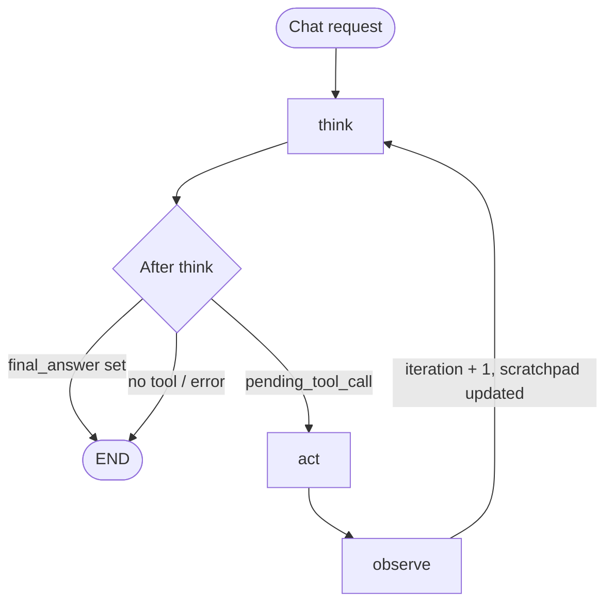

# Meridian Support

**Meridian Support** is an internal prototype for **Meridian Electronics** customer support: a small web app where authorized users sign in with Google, chat with an AI assistant, and—when configured—let the assistant call your **order and catalog** services over **MCP (Model Context Protocol)** instead of hitting databases directly.

It is built for demos and engineering evaluation, not as a production customer-facing product out of the box.

---

## What you get

- **Web UI** (Next.js): sign-in, chat, conversation history, Meridian-branded layout.
- **API** (FastAPI): Google ID token verification, JWT session cookie, chat persistence, OpenRouter-backed **ReAct** loop (think → act → observe).
- **Optional MCP**: set `MCP_SERVER_URL` on the backend to connect a **Streamable HTTP** MCP server so the model sees real tools (availability, orders, etc.). See [`backend/.env.example`](backend/.env.example).
- **Tests & CI**: backend `pytest`, frontend lint + static export, Docker image build; optional deploy to **Google Cloud Run** when GCP variables are set ([`.github/workflows/ci.yml`](.github/workflows/ci.yml)).

### Agent flow (ReAct)

The chat backend runs a compiled **LangGraph** graph: the model **thinks** (JSON: thought, optional `final_answer`, or `action` for a tool), optionally **acts** via the tool registry (including MCP), then **observes** the tool result on the scratchpad and loops until there is a final answer, a parse or API error, or the iteration cap is hit.



Implementation: [`backend/app/agents/react_graph.py`](backend/app/agents/react_graph.py).

---

## Prerequisites

- **[uv](https://docs.astral.sh/uv/)** (Python 3.11+)
- **Node.js 18+** and **npm** (frontend uses `package-lock.json` and `npm ci` in Docker/CI)

---

## Run it locally (two terminals)

### 1. Backend API

```bash
cd backend
cp .env.example .env
```

Edit `.env` and set at least **`SECRET_KEY`**, **`GOOGLE_CLIENT_ID`**, **`OPENROUTER_API_KEY`**, and **`DATABASE_URL`** (Postgres/Cockroach URL, or SQLite for quick tries—see comments in [`.env.example`](backend/.env.example)).

```bash
uv sync --group dev
uv run uvicorn app.main:app --reload --host 0.0.0.0 --port 8000
```

API docs: [http://127.0.0.1:8000/docs](http://127.0.0.1:8000/docs)

### 2. Frontend (Next dev server)

```bash
cd frontend
cp .env.example .env.local
```

Set **`NEXT_PUBLIC_GOOGLE_CLIENT_ID`** to the **same Web client ID** as `GOOGLE_CLIENT_ID` on the backend. For local split origins, set **`NEXT_PUBLIC_API_URL=http://127.0.0.1:8000`**.

```bash
npm install
npm run dev
```

Open [http://localhost:3000](http://localhost:3000)—sign in, then use **Chat**.

---

## One origin (recommended): API + static UI on port 8000

The frontend is configured for **static export**. Build it and copy the export into the backend so the browser talks to one host (simple cookies, no CORS setup):

```bash
./build_and_serve.sh
```

Then open **http://127.0.0.1:8000/** (or use [`scripts/export-static.sh`](scripts/export-static.sh) if you only want to build and copy, and start uvicorn yourself).

---

## Helpful scripts

| Script | What it does |
|--------|----------------|
| [`scripts/bootstrap.sh`](scripts/bootstrap.sh) | Creates `.env` files from examples; installs backend (`uv`) and frontend (`npm`) dependencies. |
| [`scripts/start-dev.sh`](scripts/start-dev.sh) | Runs backend on **:8000** and Next dev on **:3000** (after bootstrap). |
| [`scripts/ci-local.sh`](scripts/ci-local.sh) | Same idea as CI: backend tests + frontend **lint** + **build**. |
| [`build_and_serve.sh`](build_and_serve.sh) | Full path to a single server on **:8000** (export UI → `backend/static/` + uvicorn). |
| [`backend/start_backend.sh`](backend/start_backend.sh) | Backend only from `backend/`. |

---

## Deploying (Google Cloud Run)

**Live preview:** **[https://meridian-support-agent-r4hbkke6ba-uc.a.run.app/](https://meridian-support-agent-r4hbkke6ba-uc.a.run.app/)** — internal prototype on Cloud Run; sign in with an authorized Google account as configured for that deployment.

- The [**Dockerfile**](Dockerfile) builds a production image: **Next export** → `static/`, then **FastAPI** on `$PORT` (8080 on Cloud Run). The frontend stage uses **`npm ci`** with [`frontend/package-lock.json`](frontend/package-lock.json).
- GitHub Actions (see [`.github/workflows/ci.yml`](.github/workflows/ci.yml)) runs tests and lint, builds the image, and **can deploy** when repository variables such as **`GCP_PROJECT_ID`** are configured. Use **Workload Identity Federation** instead of long-lived JSON keys where possible.
- Production env vars and secrets are documented in the workflow and in [`backend/.env.example`](backend/.env.example) (including optional **`MCP_SERVER_URL`**, **`MCP_SERVER_ID`**, **`GOOGLE_CLIENT_SECRET`** if you pass it through to Cloud Run).

---

## Where to look in the code

| Area | Path |
|------|------|
| ReAct graph (think / act / observe) | [`backend/app/agents/react_graph.py`](backend/app/agents/react_graph.py) |
| System prompt + Meridian tone | [`backend/system_prompts/react/react_loop.md`](backend/system_prompts/react/react_loop.md) |
| MCP client (Streamable HTTP) | [`backend/app/tools/mcp_registry.py`](backend/app/tools/mcp_registry.py) |
| API entry, tool wiring | [`backend/app/main.py`](backend/app/main.py) |
| Chat UI | [`frontend/app/chat/page.tsx`](frontend/app/chat/page.tsx) |
| Copy & branding strings | [`frontend/lib/meridian.ts`](frontend/lib/meridian.ts) |

---

## MCP in one sentence

If **`MCP_SERVER_URL`** is set, the backend registers [`McpStreamableHttpToolRegistry`](backend/app/tools/mcp_registry.py) at startup, loads tool definitions from your server, and injects them into each model “think” step. If it is unset, the app runs with an empty tool list (the assistant answers without business tools).

---

Questions or improvements: open an issue or extend the prompts and UI under [`frontend/lib/meridian.ts`](frontend/lib/meridian.ts) and [`backend/system_prompts/react/react_loop.md`](backend/system_prompts/react/react_loop.md).
